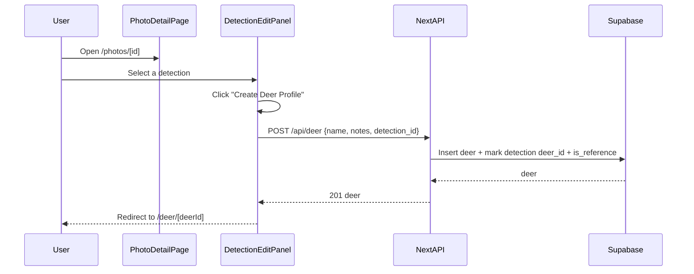

# Deer profile (buck) creation + follow flow

## Goal

- Let a user **create a deer profile they want to follow** by selecting a **reference detection** (V1) and naming it.
- Provide a **deer detail page** to view the profile and its sightings.

## What we already have (reuse)

- **DB tables**: `deer`, `detections`, `images` with RLS policies in [`supabase/migrations/001_initial_schema.sql`](supabase/migrations/001_initial_schema.sql).
- **Reference detection support**: `deer.reference_detection_id`, `detections.is_reference` in [`supabase/migrations/008_gemini_analysis.sql`](supabase/migrations/008_gemini_analysis.sql).
- **API endpoints**:
  - `POST /api/deer` (create from detection)
  - `GET /api/deer` (catalog)
  - `GET/PATCH/DELETE /api/deer/[id]` (detail/update/delete)
- **UI modal**: `CreateDeerModal` already creates from a `detectionId` in [`components/deer/create-deer-modal.tsx`](components/deer/create-deer-modal.tsx).

## Key UX flow

## Implementation outline

- **A) Fix data-model mismatches (critical)**
  - Align `lib/services/deer.ts` and `lib/services/matching.ts` with the actual schema (the SQL uses `deer.user_id`, not `deer.account_id`).
  - This ensures create/catalog/delete work reliably with existing RLS policies.

- **B) Add deer detail route + UI**
  - Create `[app/(dashboard)/deer/[id]/page.tsx](app/(dashboard)/deer/[id]/page.tsx)`.
  - Use `GET /api/deer/[id]` to show:
    - Deer name + notes
    - Sighting count
    - Sightings grid/list (thumbnail + captured_at) with links back to the photo detail.
  - Optional V1 editing: reuse `PATCH /api/deer/[id]` for name/notes.

- **C) Add “Create deer profile” entry point from photos**
  - In [`components/photos/detection-edit-panel.tsx`](components/photos/detection-edit-panel.tsx), when the selected detection is a **buck** and **unassigned** (`deerId` is null), show a CTA to open `CreateDeerModal` with that `detectionId`.
  - On success:
    - Invalidate relevant queries (`deer-catalog`, `deer/[id]`, the detection query)
    - Navigate to `/deer/[newId]`.

## Notes / constraints

- V1 **does not** include adding additional detections/photos into an existing deer profile (we’ll do that later).
- We’ll keep UI terminology as **“Deer”** (per your preference) and keep DB table name unchanged.

## Files most likely touched

- Backend/services
  - [`lib/services/deer.ts`](lib/services/deer.ts) (schema alignment + reference flagging)
  - [`lib/services/matching.ts`](lib/services/matching.ts) (schema alignment where it uses deer catalog)
- API
  - [`app/api/deer/route.ts`](app/api/deer/route.ts) (likely unchanged)
  - `[app/api/deer/[id]/route.ts](app/api/deer/[id]/route.ts)` (likely unchanged)
- UI
  - [`components/photos/detection-edit-panel.tsx`](components/photos/detection-edit-panel.tsx) (add CTA + modal)
  - `[app/(dashboard)/deer/[id]/page.tsx](app/(dashboard)/deer/[id]/page.tsx)` (new)