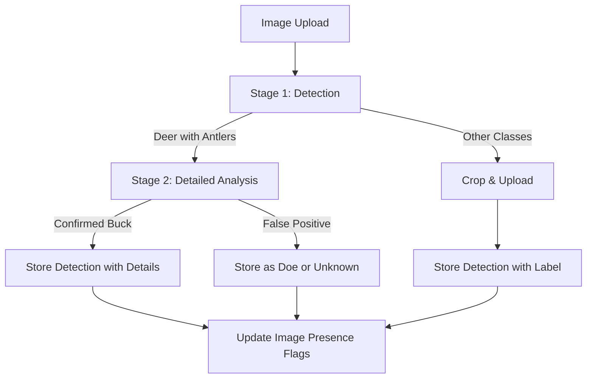

# Plan: Multi-Class Detection & Strict Antler Verification

This plan upgrades the Gemini vision pipeline to support additional animal and object classes and implements a multi-stage "Antler Audit" to eliminate false positive antler detections.

## 1. Schema & Type Updates

- Update [`lib/gemini/types.ts`](lib/gemini/types.ts) to include `hog`, `cow`, `goat`, `vehicle`, and `person` in the detection labels.
- Update [`lib/gemini/schemas.ts`](lib/gemini/schemas.ts) to reflect these changes in the structured JSON output schemas for both Stage 1 (Detection) and Stage 2 (Analysis).

## 2. Prompt Engineering

- **Stage 1 (Detection)**: Update `DETECTION_ONLY_PROMPT` in [`lib/gemini/prompts.ts`](lib/gemini/prompts.ts) to:
    - Explicitly define visual markers for Hogs, Cows, Goats, Vehicles, and People.
    - Instruct Gemini to ONLY set `has_antlers: true` for deer and ONLY if unambiguous bone is visible.
    - Provide negative constraints to ignore light artifacts and motion-blurred streaks.
- **Stage 2 (Detailed Analysis)**: Update `DEER_ANALYSIS_PROMPT` to:
    - Perform a "Species Validation" sanity check (ensure it's not a hog/cow/etc.).
    - Implement the "Branch Test": verify antlers aren't actually background branches or equipment.

## 3. Database Updates

- Create a new migration `supabase/migrations/025_multi_class_filtering.sql` to add presence flags to the `images` table:
    - `has_hogs`, `has_cows`, `has_goats`, `has_people`, `has_vehicles` (BOOLEAN).
- Update the detection record creation logic to map these labels correctly.

## 4. Pipeline Logic Refinement

- Modify [`trigger/jobs/analyze-photo.ts`](trigger/jobs/analyze-photo.ts):
    - Update Stage 1 parsing to capture all new classes.
    - Ensure non-deer detections are uploaded as crops (for the audit trail) but bypass the expensive Stage 2 Gemini call.
    - Update the final `images` table update to populate the new presence flags.
