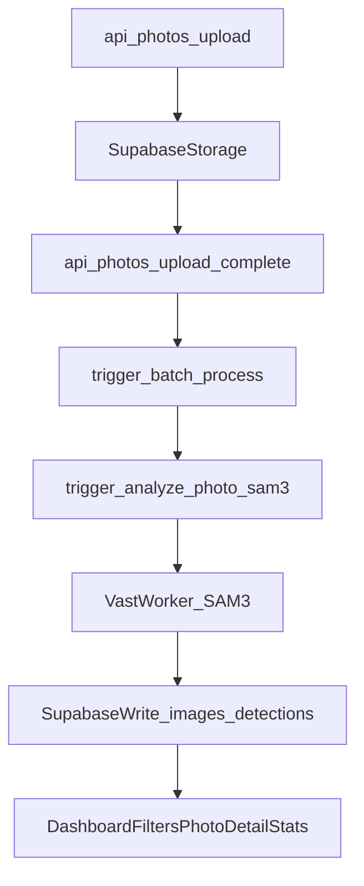

# SAM3 workflow (Vast.ai) implementation plan

## Goal

Replace Gemini-based detection with a **SAM3-based detection pipeline** ("pipeline C") that:

- runs on a **Vast.ai GPU worker** (recommended **24GB VRAM**, e.g., RTX 3090/4090)
- is orchestrated by your existing **Trigger.dev fan-out** jobs
- works cleanly with **Vercel** (Vercel stays serverless; it never loads ML weights)
- **stores boxes only** for v1 (deer boxes + antler boxes + scores)

## Key idea: where Hugging Face fits

- **Hugging Face hosts the SAM3 model** (`facebook/sam3`) and gates access [\\\\[link](https://huggingface.co/facebook/sam3)].
- The **Vast.ai worker downloads/caches the model weights** using `HF_TOKEN` and runs inference.
- **Vercel + Trigger.dev only call the worker** over HTTP.

## Current code paths we will leverage

- Upload batch creation + signed upload URLs: [`app/api/photos/upload/route.ts`](app/api/photos/upload/route.ts)
- Upload completion triggers Trigger.dev: [`app/api/photos/upload/complete/route.ts`](app/api/photos/upload/complete/route.ts)
- Batch fan-out: [`trigger/jobs/batch-process.ts`](trigger/jobs/batch-process.ts)
- Per-image analysis pattern (to mirror): [`trigger/jobs/analyze-photo.ts`](trigger/jobs/analyze-photo.ts)

## New SAM3 data flow

## Phase 0: prerequisites (one-time)

- **Hugging Face**: accept the gated model terms for `facebook/sam3` [\\\\[link](https://huggingface.co/facebook/sam3)] and create a token.
- **Vast.ai**: start an instance with **24GB VRAM** (RTX 3090/4090).

## Phase 1: Vast.ai SAM3 worker (boxes-only)

### 1.1 Worker responsibilities

- Download and load `facebook/sam3` [\\\\[link](https://huggingface.co/facebook/sam3)]
- For each image URL:
  - Run **text prompt** `"deer"` to produce instance masks/boxes/scores
  - Run **text prompt** `"antlers"` to produce instance boxes/scores
  - Return **boxes only** for v1:
    - deer boxes (xyxy pixel coords) + deer scores
    - best antler box per deer (or per antler instance) + scores

### 1.2 Worker API contract

- `GET /health` → 200 OK
- `POST /v1/analyze-image`
  - **Input**:
    - `imageUrl: string`
    - `thresholds?: { deer: number; antlers: number }`
    - `maxInstances?: number`
  - **Output**:
    - `deer_present: boolean`
    - `detections: Array<{ deer_box_xyxy: [number,number,number,number], deer_score: number, antler_box_xyxy?: [number,number,number,number], antler_score?: number }>`
    - `model: { name: "facebook/sam3", revision?: string }`

### 1.3 Cold-start and caching strategy

- Set `HF_HOME` (or equivalent) to a **persistent disk path** so restarts don’t re-download weights.
- Expect true cold start to include:
  - initial HF download (multi-GB; `facebook/sam3` is listed as 0.9B params) [\\\\[link](https://huggingface.co/facebook/sam3)]
  - model load + warmup

## Phase 2: Database additions (minimal)

Add fields to store SAM3 detections without breaking existing UI:

- `detections.analysis_source` (text): `"sam3"` (keep room for `"gemini"`)
- `detections.antler_bbox` (JSONB) for antler xyxy
- `detections.sam3_deer_score` (numeric/int)
- `detections.sam3_antler_score` (numeric/int)

Notes:

- Keep existing columns like `sex`, `species`, `antler_points` unchanged; they can remain null until a later classification stage.
- Add indexes that match your common queries (by `image_id`, `analysis_source`, etc.).

## Phase 3: Trigger.dev jobs (swap Gemini detection for SAM3)

### 3.1 New job: `analyze-photo-sam3`

Create [`trigger/jobs/analyze-photo-sam3.ts`](trigger/jobs/analyze-photo-sam3.ts) mirroring the structure of [`trigger/jobs/analyze-photo.ts`](trigger/jobs/analyze-photo.ts):

- Fetch image record
- Create signed URL from Supabase storage
- Call `SAM3_WORKER_URL/v1/analyze-image`
- Insert one row per deer into `detections` with:
  - `analysis_source = "sam3"`
  - `bbox_*` derived from deer xyxy
  - `antler_bbox` JSONB if present
  - scores
- Update `images`:
  - `detection_status = "completed"`
  - `has_deer`, `deer_count`, `analysis_notes` (optional text like "sam3")

### 3.2 Fan-out switch

Update [`trigger/jobs/batch-process.ts`](trigger/jobs/batch-process.ts) to fan-out to the SAM3 analyzer (pipeline C).

- Keep Gemini analyzer in the repo for fallback/testing, but pipeline C uses SAM3.

### 3.3 Retry + failure behavior

- Use Trigger retry policy (like existing) to handle transient worker hiccups.
- If the worker fails after retries:
  - mark `images.detection_status = 'failed'`
  - store `error_message`
  - allow user retry via existing retry endpoint.

## Phase 4: API/UI compatibility (minimal)

Ensure endpoints show SAM3 detections:

- Photo details: [`app/api/photos/[id]/route.ts`](app/api/photos/[id]/route.ts)
  - Select detections where `analysis_source='sam3'` (or default to sam3 when enabled)
- Batch stats: [`app/api/photos/stats/route.ts`](app/api/photos/stats/route.ts)
  - For v1, stats that depend on `sex/points` will be empty until you add classification; update the UI copy to clarify that v1 is detection-only.

## Phase 5: Vercel/Trigger/Vast deployment checklist

### Vercel env vars

- `SAM3_PIPELINE_ENABLED=true`
- `SAM3_WORKER_URL=https://...`

### Vast worker env vars

- `HF_TOKEN=...` (gated model access)
- `HF_HOME=/data/hf` (persistent cache path)

### Trigger.dev env vars

- Same as Vercel (worker URL, enable flag) so jobs can call the worker.

## Phase 6: Acceptance tests (pilot)

- Upload 50–500 photos.
- Verify:
  - `batch-process` fans out successfully
  - images move pending → processing → completed
  - detections exist for crowded scenes (like your 5-deer photo)
  - antler boxes appear for bucks where visible
  - retry flow works when you intentionally stop the worker

## Phase 7 (next after detection is solid)

- Add a classification stage (could be Gemini-on-crop or a dedicated classifier) to populate `sex/species/antler_points` without using Gemini for detection.
- Add MegaDescriptor embeddings on refined crops for re-ID.

## Implementation todos

- **sam3-worker**: Build and deploy Vast.ai FastAPI worker that loads `facebook/sam3` and returns deer/antler boxes.
- **db-sam3-fields**: Add migration for `analysis_source` + antler bbox + score fields + indexes.
- **trigger-sam3-job**: Add `trigger/jobs/analyze-photo-sam3.ts` and integrate worker call + DB writes.
- **batch-wire-sam3**: Update `trigger/jobs/batch-process.ts` to fan-out to SAM3 analyzer.
- **api-sam3-selection**: Update `app/api/photos/[id]/route.ts `and `app/api/photos/stats/route.ts` to display SAM3 results appropriately.
- **deploy-docs**: Document Vercel/Trigger/Vast env vars, caching, and expected cold-start behavior.