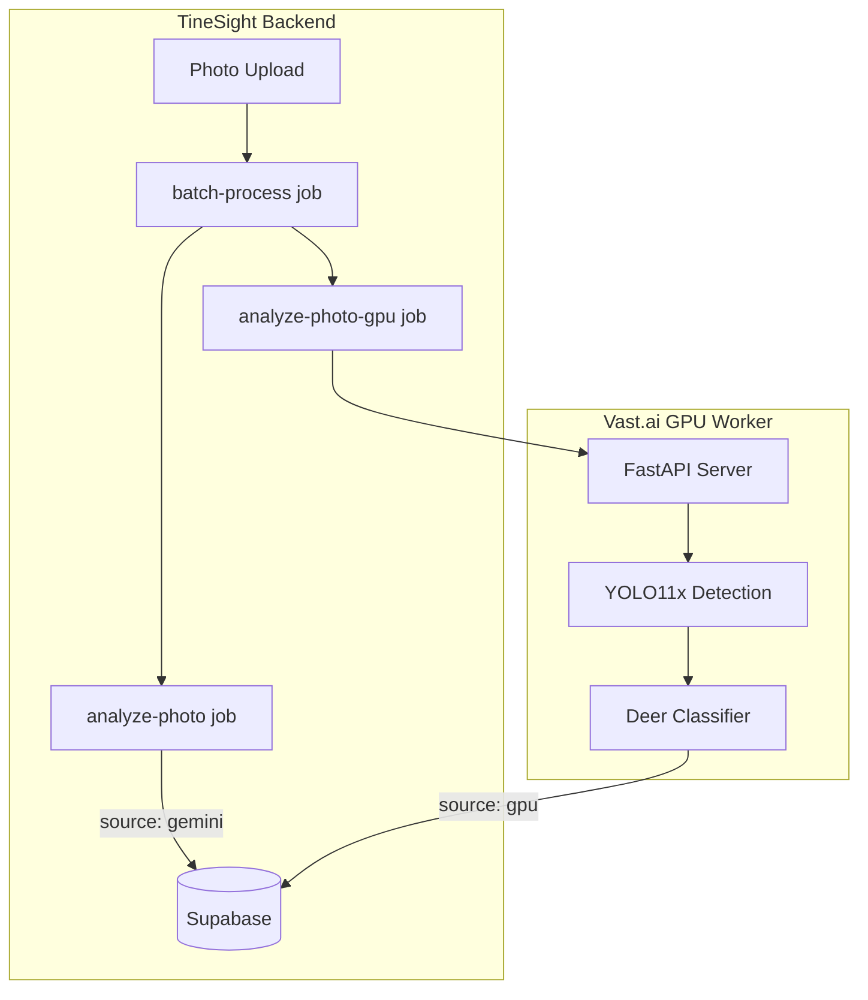

# Vast.ai GPU Sandbox Pipeline - Phase 1

## Architecture Overview



## Key Design Decisions

1. **Parallel pipelines**: Both Gemini and GPU process the same images independently
2. **Source tracking**: Add `analysis_source` field to detections to compare results
3. **Feature-flagged**: GPU pipeline controlled by env var, easy to disable
4. **Stateless worker**: GPU worker pulls from Supabase, pushes results back
5. **Cleanly removable**: All sandbox code in dedicated files/folders

## Scope (Phase 1)

| Component | GPU Pipeline | Gemini Pipeline |

|-----------|--------------|-----------------|

| Detection | YOLO11x | Gemini Vision |

| Classification (sex, age, antlers) | EfficientNetV2 classifiers | Gemini Vision |

| Embeddings | Future (Phase 2) | N/A |

| Matching | Future (Phase 2) | Gemini comparison |

---

## Implementation Plan

### 1. Database Changes

Add tracking field to compare pipeline results:

**New migration**: `supabase/migrations/007_gpu_pipeline_sandbox.sql`

- Add `analysis_source` enum column to `detections` table (`'gemini'` | `'gpu'`)
- Backfill existing detections as `'gemini'`
- Add index for filtering by source

### 2. GPU Worker (New Directory)

Create `gpu-worker/` at project root with:

| File | Purpose |

|------|---------|

| `gpu-worker/Dockerfile` | CUDA container with PyTorch, YOLO11, timm |

| `gpu-worker/requirements.txt` | Python dependencies |

| `gpu-worker/config.py` | Configuration from env vars |

| `gpu-worker/main.py` | FastAPI server with `/process-batch` endpoint |

| `gpu-worker/models/detector.py` | YOLO11x deer detection with batching |

| `gpu-worker/models/classifier.py` | EfficientNetV2 multi-head classifier (sex/age/antlers) |

| `gpu-worker/pipeline/processor.py` | Orchestrates detection + classification |

| `gpu-worker/pipeline/supabase_client.py` | Fetch images, write results |

**Note**: Classification models will initially use pretrained backbones. Fine-tuning on deer data is a future optimization.

### 3. Trigger.dev Integration

**New job**: [trigger/jobs/analyze-photo-gpu.ts](trigger/jobs/analyze-photo-gpu.ts)

- Calls GPU worker HTTP endpoint
- Writes results with `analysis_source: 'gpu'`
- Retry logic and error handling

**Modify**: [trigger/jobs/batch-process.ts](trigger/jobs/batch-process.ts)

- Check `GPU_PIPELINE_ENABLED` env var
- If enabled, trigger both `analyze-photo` (Gemini) AND `analyze-photo-gpu` jobs
- Both run in parallel on same batch

### 4. Environment Configuration

Add to `.env.local`:

```
GPU_PIPELINE_ENABLED=true
GPU_WORKER_URL=https://your-vast-instance:8000
```

### 5. Vast.ai Deployment

Create deployment files:

- `gpu-worker/vast-template.json` - Instance configuration (RTX 4090/5090)
- `gpu-worker/README.md` - Setup and deployment instructions

---

## File Changes Summary

| Action | Path |

|--------|------|

| Create | `gpu-worker/` (entire directory) |

| Create | `supabase/migrations/007_gpu_pipeline_sandbox.sql` |

| Create | `trigger/jobs/analyze-photo-gpu.ts` |

| Modify | `trigger/jobs/batch-process.ts` (add GPU branch) |

| Modify | `.env.example` (add GPU vars) |

---

## Removal for Production

When testing is complete, to remove sandbox:

1. Delete `gpu-worker/` directory
2. Delete `trigger/jobs/analyze-photo-gpu.ts`
3. Revert `batch-process.ts` changes
4. Keep or migrate `analysis_source` column (useful for audit trail)

---

## Phase 2 (Future)

After validating detection + classification:

- Add embedding generation (DINOv2 or MegaDescriptor)
- Add embedding matching against deer catalog
- Compare re-ID accuracy vs Gemini approach