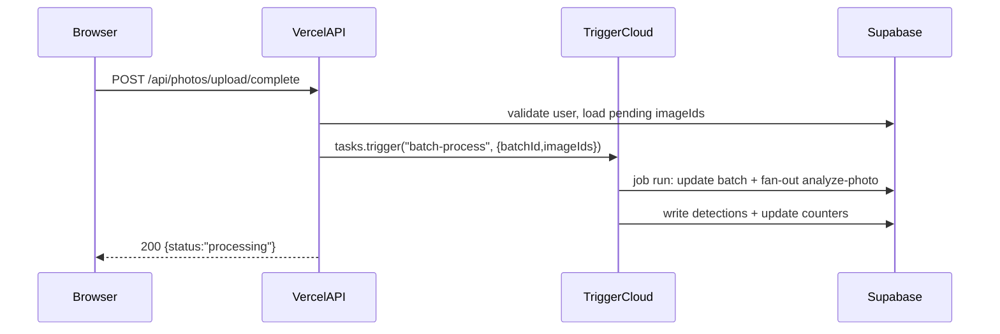

## Target architecture

- Vercel runs the Next.js app and API routes that enqueue work (e.g. `app/api/photos/upload/complete/route.ts` calling `tasks.trigger('batch-process', ...)`).
- Trigger.dev Cloud runs the actual background jobs in `trigger/jobs/*` (e.g. `batch-process`, `analyze-photo`), as defined by `trigger.config.ts`.

## Decisions already made

- Trigger runtime: Trigger.dev Cloud (managed).
- Deployment flow: GitHub-driven deployments.

## Implementation plan

### 1) Normalize Trigger.dev SDK version usage

Your repo currently imports `@trigger.dev/sdk/v3` in several places (e.g. `trigger/config.ts` already uses `@trigger.dev/sdk/v3`, API routes import `tasks` from `@trigger.dev/sdk/v3`) while `package.json` declares `@trigger.dev/sdk` `^4.3.0`.

- Decide one of:
  - **Option A (recommended)**: migrate code imports to the v4 style consistently.
  - **Option B**: pin dependencies so the installed package matches the v3 import paths.

This step is critical to prevent production build/runtime surprises.

### 2) Ensure Vercel runtime is Node (not Edge) for Trigger calls

- Confirm all routes that call Trigger (`tasks.trigger(...)`) run in Node.js runtime.
- If any route is configured for Edge, update it to Node.

Key file: `app/api/photos/upload/complete/route.ts`.

### 3) Create a strict env-var matrix (Vercel vs Trigger.dev Cloud)

- **Vercel (enqueue-only)**: include only secrets needed to authenticate to Trigger.dev and perform request-side auth/DB reads.
  - Trigger credential: `TRIGGER_SECRET_KEY` (or the exact variable your chosen SDK path expects).
  - Any Supabase *public/server* vars used by API routes.
- **Trigger.dev Cloud (execute jobs)**: include all secrets used within `trigger/jobs/*` and `lib/*` called by jobs.
  - Supabase admin: `SUPABASE_SERVICE_ROLE_KEY` and the URL var used by `createAdminClient()`.
  - Model providers: Gemini/OpenAI/Replicate tokens as used by the chosen pipeline.
  - Any storage/bucket settings needed by crop upload.

### 4) Hook up deployments

- **Vercel**:
  - Connect GitHub repo to Vercel, set Production branch (usually `main`).
  - Configure build command `npm run build` and output as Next default.
  - Add Vercel env vars for Production.

- **Trigger.dev Cloud**:
  - Create/connect the Trigger project matching `trigger.config.ts` `project` ID.
  - Configure production environment variables in Trigger.dev dashboard.
  - Add a GitHub Action (or Trigger’s GitHub integration) that runs Trigger deploy on `main`.

### 5) Observability + safety checks before launch

- **Smoke test**: call `POST /api/photos/upload/complete` on production with a small batch and confirm:
  - Vercel route returns 200 quickly.
  - Trigger.dev shows a `batch-process` run.
  - Fan-out jobs appear (`analyze-photo` / `analyze-photo-sam2` / `analyze-photo-openai`).
  - Supabase rows update correctly.

- **Idempotency audit (recommended)**:
  - Review `trigger/jobs/analyze-photo.ts` writes (inserts + counters) to ensure retries don’t duplicate detections/counters.

### 6) Production readiness follow-ups

- Decide how to handle:
  - rate limits and concurrency (you currently use `concurrencyLimit: 50` and internal `pLimit(10)`)
  - cost controls (max batch size, queueing strategy)
  - backfill/retry scripts (`scripts/retry-failed.mjs`, `scripts/trigger-batch.mjs`) and whether they should be admin-only tooling.