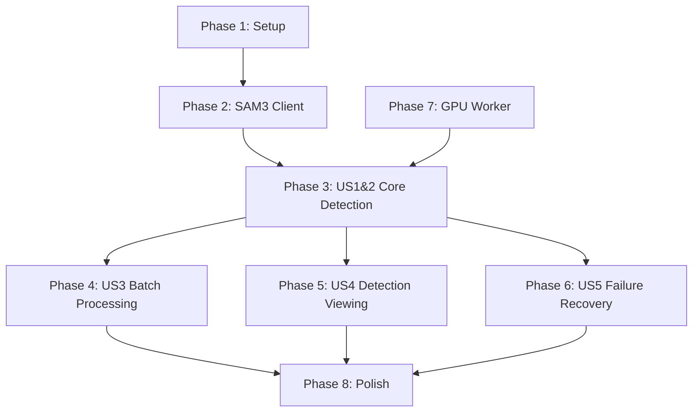

# Tasks: SAM3 Vast Pipeline

**Branch**: `009-sam3-vast-pipeline`
**Generated**: 2025-12-12
**Spec**: [spec.md](./spec.md) | **Plan**: [plan.md](./plan.md)

## Overview

| Phase | Description | Task Count |
|-------|-------------|------------|
| 1 | Setup | 6 |
| 2 | Foundational (SAM3 Client) | 5 |
| 3 | User Story 1 & 2 - Core Detection | 8 |
| 4 | User Story 3 - Batch Processing | 3 |
| 5 | User Story 4 - Detection Viewing | 2 |
| 6 | User Story 5 - Failure Recovery | 2 |
| 7 | GPU Worker (Python) | 7 |
| 8 | Polish & Integration | 4 |
| **Total** | | **37** |

---

## Phase 1: Setup

**Goal**: Database schema and environment configuration for SAM3 pipeline support.

- [X] T001 Create database migration file at `supabase/migrations/011_sam3_detection_fields.sql` with columns: analysis_source, antler_bbox, sam3_deer_score, sam3_antler_score
- [X] T002 Add indexes for analysis_source filtering in `supabase/migrations/011_sam3_detection_fields.sql`
- [X] T003 Add check constraint for valid analysis_source values ('gemini', 'sam3') in `supabase/migrations/011_sam3_detection_fields.sql`
- [X] T004 [P] Add backfill SQL to set analysis_source='gemini' for existing detections in `supabase/migrations/011_sam3_detection_fields.sql`
- [X] T005 Run migration and regenerate types with `npx supabase db push && npx supabase gen types typescript --linked > types/database.ts`
- [X] T006 Add SAM3 environment variables to `.env.example`: SAM3_PIPELINE_ENABLED, SAM3_WORKER_URL

---

## Phase 2: Foundational - SAM3 Client Library

**Goal**: TypeScript client for communicating with GPU worker. Blocks all user stories.

**Blocking Dependency**: All user story phases require this client library.

- [X] T007 Create feature flag helper at `lib/config/feature-flags.ts` with `isSam3PipelineEnabled()` function reading SAM3_PIPELINE_ENABLED env var
- [X] T008 Create SAM3 client at `lib/sam3/client.ts` with Sam3Client class implementing `analyzeImage(imageUrl, options)` and `checkHealth()` methods per OpenAPI contract
- [X] T009 Add typed response interfaces in `lib/sam3/client.ts` for HealthResponse, AnalyzeImageResponse, Detection per API contract schemas
- [X] T010 Create WebSocket health listener at `lib/sam3/health.ts` with Sam3HealthListener class implementing `waitForReady(timeoutMs)` promise-based wait
- [X] T011 Add HTTP polling fallback in `lib/sam3/health.ts` when WebSocket connection fails (5-second interval polling of /health endpoint)

---

## Phase 3: User Story 1 & 2 - Core Detection (P1)

**Goal**: Accurate deer detection with antler bounding boxes from SAM3 pipeline.

**User Story 1**: As a hunting lease operator, I want deer detection to accurately identify all deer in my trail camera photos.

**User Story 2**: As a hunting lease operator, I want the system to detect antler regions on bucks for future re-identification.

**Independent Test**: Upload 10 photos with single/multiple deer and bucks with antlers. Verify all deer detected with bounding boxes, antler boxes appear for bucks.

**Acceptance Criteria**:
- Single deer photos: 1 detection with bbox
- Multi-deer photos (5 deer): 5 separate detections
- Buck photos: deer bbox + antler_bbox stored
- Doe photos: deer bbox only, no antler_bbox
- Empty photos: deer_present=false, no detections

- [X] T012 [US1] Add `createSam3Detections(imageId, detections)` function to `lib/services/detections.ts` setting analysis_source='sam3' and converting pixel coords to 0-10000 scale
- [X] T013 [US2] Add antler_bbox JSONB handling in `createSam3Detections()` at `lib/services/detections.ts` for storing antler bounding boxes
- [X] T014 [US1] Update `getDetectionsForImage()` in `lib/services/detections.ts` to include analysis_source, antler_bbox, sam3_deer_score, sam3_antler_score in response
- [X] T015 [US1] Create Trigger.dev job at `trigger/jobs/analyze-photo-sam3.ts` with task id 'analyze-photo-sam3', concurrency limit 10, retry config (3 attempts, exponential backoff)
- [X] T016 [US1] Implement worker health check pre-dispatch in `trigger/jobs/analyze-photo-sam3.ts` using Sam3HealthListener.waitForReady(180000) before API call
- [X] T017 [US1] Implement SAM3 worker API call in `trigger/jobs/analyze-photo-sam3.ts` with 60-second timeout, signed URL fetch, and Sam3Client.analyzeImage()
- [X] T018 [US1] Add detection insertion and image status update in `trigger/jobs/analyze-photo-sam3.ts` calling createSam3Detections() and updating images.detection_status
- [X] T019 [US1] Export analyze-photo-sam3 job from `trigger/index.ts`

---

## Phase 4: User Story 3 - Batch Processing (P2)

**Goal**: Automatic batch processing using SAM3 pipeline when feature flag enabled.

**User Story 3**: As a hunting lease operator, I want to upload batches of photos and have them all processed automatically.

**Independent Test**: Upload batch of 50 photos with SAM3_PIPELINE_ENABLED=true. Verify all enter queue and complete processing with SAM3 detections.

**Acceptance Criteria**:
- Batch upload triggers batch-process job
- batch-process fans out to analyze-photo-sam3 when flag enabled
- Progress visible (pending, processing, completed counts)
- 100 photos complete within 15 minutes

- [X] T020 [US3] Add feature flag check in `trigger/jobs/batch-process.ts` importing isSam3PipelineEnabled() from lib/config/feature-flags
- [X] T021 [US3] Update fan-out logic in `trigger/jobs/batch-process.ts` to dispatch analyzePhotoSam3 job when SAM3 enabled, keeping analyzePhoto (Gemini) as fallback
- [X] T022 [US3] Import analyzePhotoSam3 job in `trigger/jobs/batch-process.ts` and use batchTriggerAndWait() for fan-out

---

## Phase 5: User Story 4 - Detection Viewing (P2)

**Goal**: Display SAM3 detection results with confidence filtering in UI.

**User Story 4**: As a hunting lease operator, I want to view detection results showing deer locations and confidence scores.

**Independent Test**: View processed photo with SAM3 detections. Verify bounding boxes overlay correctly, confidence scores display, detections < 0.3 filtered from view.

**Acceptance Criteria**:
- Deer bounding boxes overlay on photo
- Antler bounding boxes visible (if detected)
- Confidence scores shown per detection
- Detections with sam3_deer_score < 0.3 filtered from UI display

- [X] T023 [US4] Update detection confidence filtering in `lib/services/detections.ts` getDetectionsForImage() to filter by sam3_deer_score >= 0.3 when analysis_source='sam3'
- [X] T024 [US4] Verify existing detection overlay component at `components/photos/detection-overlay.tsx` handles antler_bbox rendering (or add support if missing)

---

## Phase 6: User Story 5 - Failure Recovery (P3)

**Goal**: Retry failed SAM3 processing with user-friendly error messages.

**User Story 5**: As a hunting lease operator, I want failed photo processing to be retryable.

**Independent Test**: Cause a processing failure (e.g., stop worker), verify photo shows failed status with error message, retry succeeds when worker available.

**Acceptance Criteria**:
- Failed photos show failure status with user-friendly message
- Retry button re-queues photo
- Retried photos process successfully when worker ready
- 95% retry success rate

- [X] T025 [US5] Add user-friendly error messages in `trigger/jobs/analyze-photo-sam3.ts` for timeout (60s exceeded) and worker unavailable scenarios
- [X] T026 [US5] Verify retry endpoint at `app/api/photos/[id]/retry/route.ts` works with SAM3 pipeline (should work automatically via batch-process feature flag)

---

## Phase 7: GPU Worker (Python)

**Goal**: FastAPI application running SAM3 model on Vast.ai GPU.

**Note**: This phase can be developed in parallel with TypeScript phases by a separate developer or as a separate repository.

- [X] T027 [P] Create Python project structure at `sam3-worker/` with main.py, inference.py, health.py, requirements.txt
- [X] T028 [P] Add requirements.txt at `sam3-worker/requirements.txt` with fastapi, uvicorn, transformers, torch, huggingface_hub, websockets, pillow, httpx
- [X] T029 Implement health endpoints in `sam3-worker/health.py`: GET /health returning HealthResponse schema, WebSocket /ws/status for status streaming
- [X] T030 Implement model loading in `sam3-worker/inference.py`: load facebook/sam3 from HuggingFace with HF_TOKEN, cache to HF_HOME, broadcast status during warmup
- [X] T031 Implement inference logic in `sam3-worker/inference.py`: run SAM3 with text prompts "deer" and "antlers", match antler boxes to nearest deer boxes
- [X] T032 Implement POST /v1/analyze-image endpoint in `sam3-worker/main.py` per OpenAPI contract: fetch image, run inference, return AnalyzeImageResponse
- [X] T033 Create Dockerfile at `sam3-worker/Dockerfile` for Vast.ai deployment with CUDA base image, Python 3.11, HF_HOME volume mount

---

## Phase 8: Polish & Integration

**Goal**: Cross-cutting concerns and integration verification.

- [ ] T034 Add SAM3 pipeline documentation to `quickstart.md` with Vast.ai setup instructions and troubleshooting guide
- [ ] T035 Update CLAUDE.md Active Technologies section with SAM3 pipeline references
- [ ] T036 Create integration test file at `tests/integration/sam3-pipeline.test.ts` with mocked worker responses testing job dispatch and detection creation
- [ ] T037 Manual E2E test: Upload batch with SAM3 enabled, verify detection_source='sam3' in database, bounding boxes display correctly in UI

---

## Dependencies

**Critical Path**: Phase 1 → Phase 2 → Phase 3 → Phase 4/5/6 → Phase 8

**Parallel Opportunities**:
- Phase 7 (GPU Worker) can be developed independently
- Within Phase 3: T012-T014 (service layer) parallel with T015-T019 (job)
- Phase 4, 5, 6 can run in parallel after Phase 3 completes

---

## Implementation Strategy

### MVP Scope (Recommended)

**Minimum Viable Implementation**: Phases 1-3 + Phase 7

This delivers:
- Database schema ready
- SAM3 client library
- Core detection job (US1 & US2)
- GPU worker

Users can manually trigger SAM3 processing, verifying detection accuracy before enabling batch automation.

### Incremental Delivery

1. **Week 1**: Phase 1-2 (Schema + Client) - Foundation
2. **Week 1-2**: Phase 7 (GPU Worker) - Can parallel with above
3. **Week 2**: Phase 3 (Core Detection) - E2E detection working
4. **Week 3**: Phase 4-6 (Batch, Viewing, Recovery) - Production ready
5. **Week 3**: Phase 8 (Polish) - Documentation and tests

### Task Count by User Story

| User Story | Priority | Tasks | Description |
|------------|----------|-------|-------------|
| Setup | - | 6 | Database, env vars |
| Foundational | - | 5 | SAM3 client library |
| US1 & US2 | P1 | 8 | Core deer + antler detection |
| US3 | P2 | 3 | Batch processing |
| US4 | P2 | 2 | Detection viewing |
| US5 | P3 | 2 | Failure recovery |
| GPU Worker | - | 7 | Python FastAPI worker |
| Polish | - | 4 | Docs, tests |
| **Total** | | **37** | |

---

## Parallel Execution Examples

### Example 1: Two developers

**Developer A (TypeScript)**:
- Day 1: T001-T006 (Setup)
- Day 2: T007-T011 (Client Library)
- Day 3-4: T012-T019 (Core Detection)
- Day 5: T020-T026 (Batch, Viewing, Recovery)

**Developer B (Python)**:
- Day 1-3: T027-T033 (GPU Worker)
- Day 4: Integration testing with Developer A
- Day 5: T034-T037 (Polish)

### Example 2: Single developer

**Sequential critical path**:
T001-T006 → T007-T011 → T027-T033 (worker needed for testing) → T012-T019 → T020-T026 → T034-T037

---

## Validation Checklist

Before marking feature complete:

- [ ] All 37 tasks completed
- [ ] Database migration applied successfully
- [ ] SAM3 client connects to worker
- [ ] Worker health check returns ready
- [ ] Single photo detection works (US1)
- [ ] Antler boxes detected for bucks (US2)
- [ ] Batch processing uses SAM3 when flag enabled (US3)
- [ ] UI displays detections with confidence filter (US4)
- [ ] Retry flow works after failure (US5)
- [ ] 100-photo batch completes in < 15 minutes
- [ ] Integration tests pass
